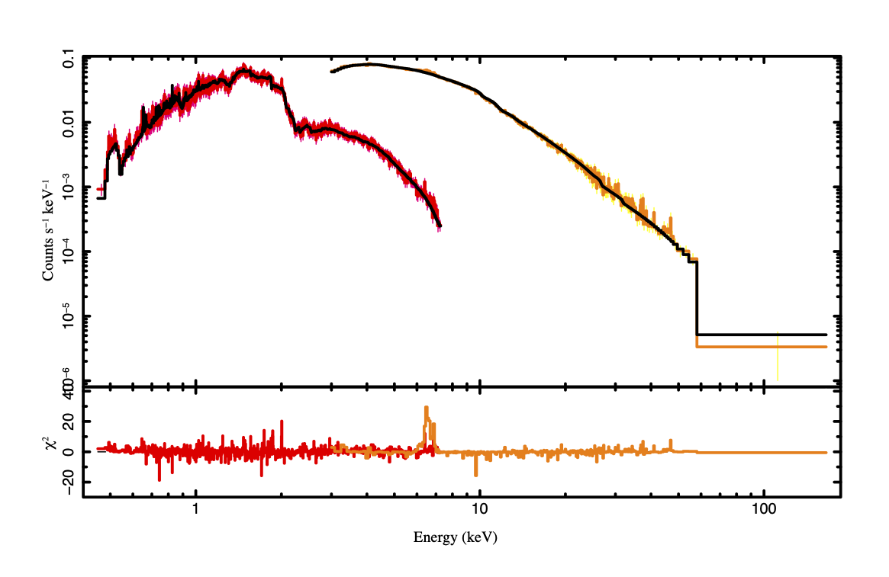

# adaf_xray

A local model to fit the ADAF(advection dominated accretion flow) in [Xspec](https://heasarc.gsfc.nasa.gov/xanadu/xspec/) and [ISIS](http://space.mit.edu/cxc/isis/).

Because the maximum temperature of apec is about 64(or 86)keV, the inner and hotter area is caculated by bremsstrahlung.
Tint is the temparature at the interface between apec or bremsstrahlung. 
Scale is the normalization which makes the connection at the boundary at Tint smoothly, i.e. differential emission measure is continuous.   
Note that, bremsstrahlung doesn't consider metal abundance. 


# Instruction
Compile this model with the following steps in the Xspec interface:

```shell
initpackage adaf lmodel.dat .
rm -f *~ *.o *FunctionMap.* lpack_* Makefile pkgIndex.tcl
lmod adaf .
```

## Example 
**M81\***


